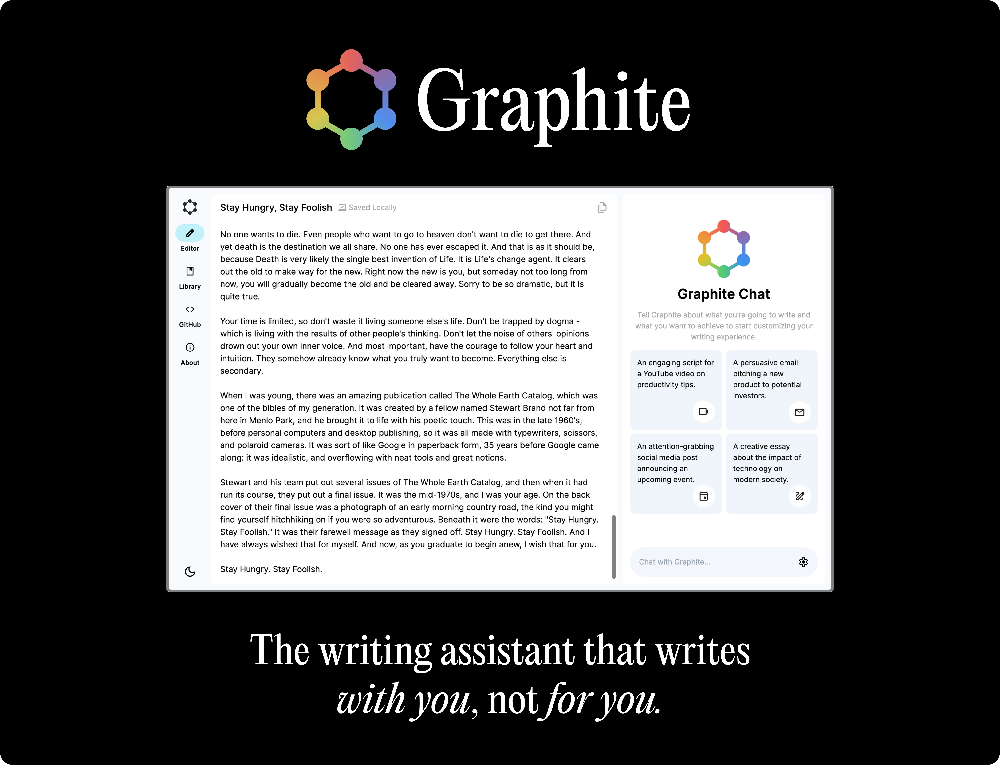

<p align='center'>
Try Graphite at <a href="https://graphite-editor.vercel.app">graphite-editor.vercel.app</a> | See Graphite <a href="https://www.youtube.com/watch?v=R2zYceZMa7I">in Action on YouTube</a>
</p>

## Using Graphite

Go to [graphite-editor.vercel.app](https://graphite-editor.vercel.app), and follow the onboarding to get started.

If you need Help with a specific section, go to the Help tab on the left (or [click this link](https://graphite-editor.vercel.app/help)) and navigate using the top menu.

## Techstack

[](https://skillicons.dev)

Graphite is built from the ground up with a cutting-edge techstack, optimized for maintainability and speed.

- [React 18](https://react.dev/) with the [Next.js 14](https://nextjs.org/) framework
  - Next and React enable maintainable and efficient code.
- [Tailwind CSS](https://tailwindcss.com/)
  - Tailwind CSS enables concise and easy-to-read styles, as well as theming support with [Next Themes](https://www.npmjs.com/package/next-themes)
- [Google AI Studio/Gemini API](https://aistudio.google.com/app/prompts/new_chat)
  - Google Gemini 1.5 Pro offers a powerful model with a long context and function calling, perfect for Graphite
- [Vercel AI SDK](https://sdk.vercel.ai/docs/introduction)
  - Vercel AI SDK allows accessing Gemini efficiently in Next.js and enables easy access to features like streaming and function-calling
- [React Markdown](https://github.com/remarkjs/react-markdown) by Remark
  - Remark's React Markdown library enables parsing of Gemini's markdown output.
- [Bun](https://bun.sh/) Javascript Runtime and Toolkit
  - Bun, the fastest JS Runtime and Package Manager, speeds up downloading libraries and running scripts
- Hosted on [Vercel](https://vercel.com/home)
  - Vercel's smooth integration with Next.js makes production easy and fast.

## Design Philosophy

Graphite's was designed to emphasize familiarity and simplicity, but yet provide a powerful editor for aspiring writers and authors alike.

The clean and uncluttered interface feels free and open, to allow creative designs to flourish, and your work to take center stage.

Furthermore, for simplicity, Graphite is split into 3 key sections: The Editor, the Graphite Chat, and the Library. Each has its own dedicated purpose, and yet aware of each other's information. From the Chat, you can ask about what you have written in the Editor. From the Library, you can preview what you have written, and select the correct file, and so on.

## Design Elements

Graphite's design is heavily inspired by the [Material UI 3/Material You](https://m3.material.io/) design language. [^1^]

Theming is done through Tailwind CSS's built in theme structure, which are in turn linked to CSS variables that change based on light/dark mode, controlled by [Next Themes](https://www.npmjs.com/package/next-themes).

Iconography is provided by [Google's Material Symbols](https://fonts.google.com/icons), a dynamic icon set to provide the perfect icon in the perfect weight or size for any occasion.

The font used is Inter, a 2-axes variable font by [Google Fonts](https://fonts.google.com/specimen/Inter) to compliment the Material Symbols and to find the perfect font weight throughout the app.

[^1^]: Graphite was not built to adhere to every guideline in Material UI 3, and there are various parts which do not use Material UI 3 design.

## Development

Ensure you have [Bun](https://bun.sh/) installed.

Start by cloning the repository:

```bash
git clone https://github.com/EvanZhouDev/graphite
```

Then, `cd` into the repository and install the dependencies with `bun`:

```bash
cd graphite
bun install
```

Finally, start the development server with `bun dev`:

```bash
bun dev
```

Open [http://localhost:3000](http://localhost:3000) (by default) or `localhost` on the port that you have been assigned by Next.js if 3000 has already been taken.
